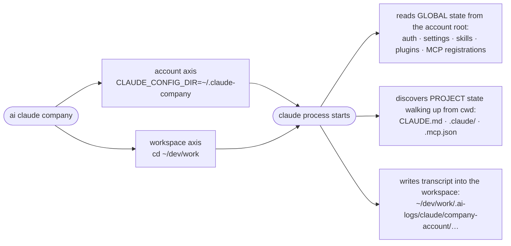
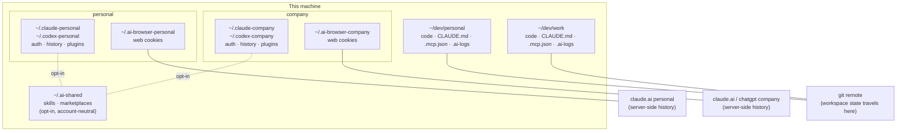

# FAQ: the questions everyone actually asks

**Language:** English · [한국어](../ko/FAQ.md)

Honest answers, including the uncomfortable ones. Companion to
[REMOTE-ACCESS.md](./REMOTE-ACCESS.md) (how to connect) and
[ARCHITECTURE.md](./ARCHITECTURE.md) (how identity routing works).

---

## Table of contents

1. [How far can a Raspberry Pi (32GB SD card) actually go?](#1-how-far-can-a-raspberry-pi-32gb-sd-card-actually-go)
2. [Can I skip the central host and just sync everything between machines?](#2-can-i-skip-the-central-host-and-just-sync-everything-between-machines)
3. [Do all my devices have to route through the Pi?](#3-do-all-my-devices-have-to-route-through-the-pi)
4. [Why can't I do company work from home, around the company network?](#4-why-cant-i-do-company-work-from-home-around-the-company-network)
5. [Which layer owns what? (machine / account / tool / workspace / browser)](#5-which-layer-owns-what-machine--account--tool--workspace--browser)
6. [What do CLI, web, and GUI share? What about skills, MCP, plugins?](#6-what-do-cli-web-and-gui-share-what-about-skills-mcp-plugins)

---

## 1. How far can a Raspberry Pi (32GB SD card) actually go?

Further than you'd guess for some jobs, and nowhere near far enough for others.
The ceilings, in the order you will actually hit them:

1. **RAM** (Pi 4 ships with 2/4/8GB). One interactive Claude Code or Codex
   session is a Node/Rust process using a few hundred MB — fine on 4GB. What
   kills it is *agentic* load: subagent fan-outs, indexing a large repo, or the
   agent kicking off `npm install` / a test suite. Those push into swap, and
   swap on an SD card means a crawl **plus** card wear.
2. **SD card I/O — not capacity.** 32GB is plenty of *space* (Raspberry Pi OS +
   toolchain lands around 9GB; a real install measured 33% used). The problem is
   random-I/O speed and write endurance: `git status` on a big repo and package
   installs are painfully slow, and logs + swap chew through cheap cards.
3. **CPU**, last. Terminal work and chat-style sessions are light; builds and
   test runs the agent triggers are where four little ARM cores tap out.

**What a Pi does brilliantly:**

- Always-on **tmux host**: park a session, attach from your phone in the subway
  ([REMOTE-ACCESS.md §6.4](./REMOTE-ACCESS.md#64-workflow-d-always-on-home-server)).
- Tailscale **entry point / subnet router**: the machine that is always
  reachable even when every laptop is asleep in a bag.
- Light, single-agent, chat-style sessions; queued overnight jobs where wall
  clock doesn't matter.

**What it does badly:** multi-agent orchestration, big builds, anything
RAM-hungry. Don't fight it — that work belongs on the Mac.

**Upgrades, in bang-for-buck order:**

1. A proper **5V/3A power supply** — an underpowered Pi doesn't feel slow, it
   *reboot-loops* ([§8.12](./REMOTE-ACCESS.md#812-raspberry-pi-reboot-loops--dies-under-load)).
2. **Boot from a USB SSD** — the single biggest performance change on a Pi 4;
   fixes I/O speed *and* the endurance worry in one move.
3. **zram swap** (compressed RAM) instead of SD-card swap.
4. A high-endurance SD card, if you stay on SD.
5. Still not enough → a used **mini PC** (Intel N100, 8–16GB) is the sweet
   spot; the Pi goes back to being a fine gateway.

The pattern that always works: **Pi as the front door, Mac as the muscle.**
SSH to the Pi is always possible; the heavy session runs on the Mac.

## 2. Can I skip the central host and just sync everything between machines?

Partially. Sort everything you care about into three buckets:

| Bucket | Examples | Syncs? |
|--------|----------|--------|
| **Files in the workspace** | code, generated reports, diffs, docs | ✓ perfectly — this is what git (or Syncthing) is for |
| **Account state** | sessions, chat history, transcripts, plugin caches, auth | ✗ deliberately not — it is machine + account local |
| **Live processes** | the running agent, the tmux session | ✗ physically impossible — a running process is not a file |

The second row is not an accident. Account roots contain machine-scoped paths,
caches, and credentials (on macOS, Claude auth lives in the **Keychain**, which
cannot leave the machine at all — see
[ARCHITECTURE.md §5](./ARCHITECTURE.md#5-known-limitations)). Syncing account
roots between machines invites exactly the state-mixing this router exists to
prevent.

So a pure-sync setup tops out at: **same code and same artifacts everywhere,
but each machine keeps its own history and its own running sessions.** If what
you want is "walk away from the desk, pick up the *same live session* on the
phone" — that is not a sync problem, that is a session-host problem, and the
answer is one machine that runs the session while everything else attaches
(question 3).

Making artifacts flow between hosts more automatically is tracked in
[BACKLOG.md](../../BACKLOG.md) ("cross-host artifact/session continuity").

## 3. Do all my devices have to route through the Pi?

No. Tailscale is a **mesh**, not hub-and-spoke — every device talks directly to
every other device:

```
        ┌────────┐  direct   ┌─────────┐
        │ iPhone │◄─────────►│ M3 Max  │
        └───┬────┘           └────┬────┘
            │        direct       │
            │     ┌────────┐      │
            └────►│   Pi   │◄─────┘
                  └────────┘
     every edge is a direct connection; nothing relays through the Pi
```

The Pi adds **availability**, not routing: it is the node that is *always* on,
so it is the one you can reach when the Mac is asleep or in a bag. When the Mac
is awake, `ssh doritos-m3-max` from the phone goes straight there.

Use the Pi as: the place long-lived tmux sessions park, the box that never
sleeps, optionally a subnet router for non-Tailscale LAN devices. Not as: a
mandatory hop.

## 4. Why can't I do company work from home, around the company network?

Mechanically? You could. This repo's docs literally teach every building block.
The blocker was never technology, so here is the honest breakdown — because
"work from home" is actually three different things:

| Case | What it looks like | Verdict |
|------|--------------------|---------|
| **(a) Company laptop at home, company VPN** | You take the work machine home and connect the way IT provides | ✅ That's just remote work. Do this. |
| **(b) Personal device via a sanctioned channel** | BYOD policy, corporate VDI, a company Tailscale tenant, written IT approval | ✅ Ask. Often granted. |
| **(c) Personal infra reaching *around* the company network** | Unapproved Tailscale on the work laptop, company repos copied to a home machine, tunnels that dodge monitoring | ❌ This is the one that ends careers. |

The phrase "avoiding the company network" (**회사 망 피해서**) is precisely
what turns (a)/(b) into (c). Why (c) is different in kind, not degree:

- **In policy terms it is exfiltration**, regardless of intent. Company data
  flowing over infrastructure the company can't see *is the definition*.
- **It is visible.** EDR/DLP on the work laptop sees the VPN client install;
  the network sees the tunnel. You are not hiding, you are enumerating yourself.
- **It converts your standing.** The day *anything* leaks — even something
  unrelated to you — the person with an unauthorized data channel is the first
  name on the list. "I was just working late" does not survive contact with an
  incident review.

The good news, and it is genuinely good: **if VPN use is already ambient at
your company, the written ask is easy.** Ambient tolerance is not a policy
([REMOTE-ACCESS.md §7.3](./REMOTE-ACCESS.md#73-work-devices-get-permission)),
but it *is* strong evidence the answer will be yes. Get the yes in writing and
you are in case (b) — same convenience, none of the exposure.

And remember what needs no permission at all: your **personal** projects, from
anywhere, on your own machines and tailnet. That freedom is the entire point of
splitting identities in the first place.

## 5. Which layer owns what? (machine / account / tool / workspace / browser)

The mental model: a session is the **intersection of independent axes**, and
each axis owns a different kind of state. The router
([ARCHITECTURE.md §2](./ARCHITECTURE.md#2-core-idea-orthogonal-axes)) just makes
you pick each axis on purpose.

```
Machine (e.g. M3 Max)      ← tmux sessions, running agents, Tailscale node
│                            identity, macOS Keychain: these NEVER leave the box
└── OS user (you)
    ├── ACCOUNT axis — env var picks one    (auth, billing, history)
    │     ~/.claude-personal   ~/.codex-personal
    │     ~/.claude-company    ~/.codex-company
    │
    ├── WORKSPACE axis — cd picks one       (files, logs, project config)
    │     ~/dev/personal   → .ai-logs/  CLAUDE.md  .claude/  .mcp.json
    │     ~/dev/work       → .ai-logs/  CLAUDE.md  .claude/  .mcp.json
    │
    ├── BROWSER axis — data-dir picks one   (web login cookies)
    │     ~/.ai-browser-personal    ~/.ai-browser-company
    │     ~/.claude-app-personal    ~/.claude-app-company   (GUI apps)
    │
    └── ~/.ai-shared — the ONE deliberately shared place
          (opt-in: skills / plugin marketplaces shared across accounts)
```

What actually happens on `ai claude company`:



The answer to "where does recognition even start?" is that third arrow pair:
**global state follows the env var; project state follows the directory you are
standing in.** A workspace is "virtual" only in the sense that it is a plain
directory — the tools genuinely resolve project config by walking up from
`cwd`, so the directory boundary *is* the workspace boundary. The router's whole
job is making sure the env var and the cwd point at the same identity before the
tool starts.

## 6. What do CLI, web, and GUI share? What about skills, MCP, plugins?

The full sharing matrix — "account" columns assume the same machine; the last
column asks whether the thing follows you to another machine:

| State | Lives at | Shared across accounts? | Follows you across machines? |
|-------|----------|-------------------------|------------------------------|
| Claude CLI auth | macOS Keychain (keyed per config dir) | ✗ | ✗ Keychain is machine-bound |
| Codex CLI auth | `$CODEX_HOME/auth.json` | ✗ | ✗ (a file, but don't copy creds) |
| CLI chat history / sessions | account root | ✗ | ✗ |
| Skills, plugins | account root — or `~/.ai-shared` (opt-in shared store) | opt-in ✓ | ✗ (but git-able) |
| MCP servers, global | account root config (per-account tokens) | ✗ | ✗ |
| MCP servers, project | `.mcp.json` in the workspace | follows the *workspace*, not the account | ✓ if the repo syncs |
| Project memory (`CLAUDE.md`, `.claude/`) | workspace | follows the workspace | ✓ via git |
| Terminal transcripts (`.ai-logs/`) | workspace, **on the host where `ai` ran** | follows the workspace | ✗ unless synced |
| Web chat (claude.ai / chatgpt.com) | **provider's servers** | ✗ separate web logins | ✓ any device, same login |
| GUI app data (Claude.app) | `~/.claude-app-<id>` | ✗ | ✗ |
| tmux sessions, running agents | the machine | n/a | ✗ — the reason session hosts exist |

Three rows deserve emphasis:

- **Web is the odd one out.** CLI history is local (account root, this
  machine); *web* chat history lives on Anthropic's/OpenAI's servers and follows
  your web login to any device. The same "account" concept lands in completely
  different places depending on the surface. That's why the browser axis exists:
  `~/.ai-browser-company` keeps the *company web login's cookies* isolated the
  same way `~/.claude-company` keeps the company CLI auth isolated.
- **MCP splits by scope.** Project-scoped `.mcp.json` travels with the repo —
  any account, any machine that opens the workspace sees it. Globally-registered
  MCP servers (with their tokens) sit in the account root and stay there. When
  wiring MCP by hand ([ARCHITECTURE.md §6](./ARCHITECTURE.md#6-mcp-deliberately-out-of-scope-v1)),
  put shareable, secret-free servers in `.mcp.json`, and anything with a token
  in the account root.
- **Skills/plugins are per-account by default**, which means installing a skill
  twice (once per account). The `~/.ai-shared` symlink pattern collapses the
  duplication while auth/sessions stay split — codifying it as an `ai` command
  is a [BACKLOG.md](../../BACKLOG.md) candidate ("shared-store command").

And the same matrix as a picture:



Everything inside the machine box stays on the machine unless a line leaves the
box: workspaces travel via git, web history lives with the provider, and the
shared store is the one deliberate bridge between accounts.
